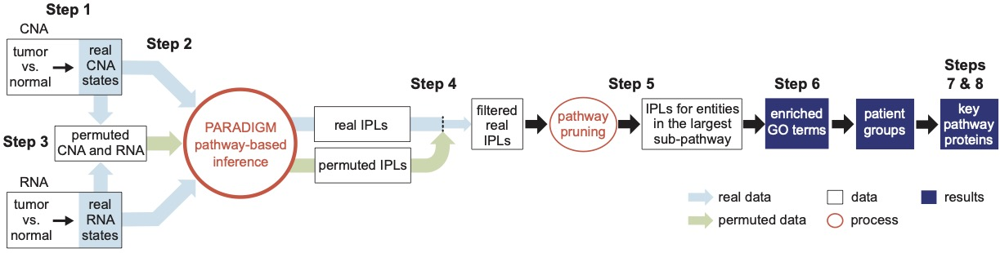

```{r setup, include = FALSE}
knitr::opts_chunk$set( cache = TRUE, collapse = TRUE, echo = TRUE,
    message = FALSE, warning = FALSE, fig.align = 'center',
    dev.args=list(fix_text_size=FALSE ), comment = "#>")

options( htmltools.dir.version = FALSE, formatR.indent = 2,
    width = 55, digits = 4, warnPartialMatchAttr = FALSE,
    warnPartialMatchDollar = FALSE, tinytex.verbose=TRUE)

require(data.table)

require(MPAC)
```

# Introduction

From copy-number alteration (CNA), RNA-seq data, and pre-defined biological
pathway network, MPAC computes Inferred Pathway Levels (IPLs) for pathway 
entities, clusters patient samples by their enriched GO terms, and identifies
key pathway proteins for each patient cluster.

## Workflow

```{r WorkflowJPG, fig.cap='MPAC workflow', out.width='800px', echo=FALSE}

```

## Pseudocode

```{r pseudocode, eval=FALSE}
FOR each sample:
    ## Step 1
    prepare CNA states from real data

    prepare RNA states from real data

    ## Step 2
    compute IPLs by PARADIGM using CNA and RNA states from real data as well as
    the input pathway definition

    ## Step 3
    REPEAT 100 times:
        randomly permute CNA and RNA states between genes

        compute IPLs by PARADIGM using CNA and RNA states from permuted data as
        well as the input pathway definition

    ## Step 4
    FOR each pathway entity:
        filter entity’s IPL from real data by its 100 IPLs from permuted data

    ## Step 5
    based on the input pathway definition, select the largest sub-pathway with 
    all of its entities with non-zero IPLs

    ## Step 6
    FOR each GO term in GMT file collections:
        do enrichment analysis using genes from the largest sub-pathway

cluster samples by their GO enrichment results

## Step 7
pick a sample group of interest

find submodules shared by the largest sub-pathways of all samples in this group

identify key pathway proteins from submodules

## Step 8
evaluate the correlation of key protein’s IPLs with patients’ clinical data
```

# Installation

## From GitHub

Start R and enter:

```{r installFromGitHub, eval=FALSE}
devtools::install_github('pliu55/MPAC')
```

## From Bioconductor

Start R and enter:

```{r installFromBioconductor, eval=FALSE}
if (!requireNamespace("BiocManager", quietly = TRUE))
    install.packages("BiocManager")

# The following initializes usage of Bioc devel
BiocManager::install(version='devel')

BiocManager::install("MPAC")
```

For different versions of R, please refer to the appropriate
[Bioconductor release](https://bioconductor.org/about/release-announcements/).


# Required R packages for this vignette

Please use the following code to load required packages for running this
vignette. Many intermediate objects in this vignette are SummarizedExperiment
objects.

```{r requiredPkg}
require(SummarizedExperiment)
require(MPAC)
```

# Main functions

- `ppCnInp()`: prepare CNA states from real CNA data
- `ppRnaInp()`: prepare RNA states from read RNA-seq data
- `ppRealInp()`: prepare CNA and RNA states from read CNA and RNA-seq data
- `ppPermInp():` prepare permuted CNA and RNA states 
- `runPrd()`: run PARADIGM to compute IPLs from real CNA and RNA states
- `runPermPrd()`: run PARADIGM to compute IPLs from permuted CNA and RNA states
- `colRealIPL()`: collect IPLs from real data
- `colPermIPL()`: collect IPLs from permuted data
- `fltByPerm()`: filter IPLs from real data by IPLs from permuted data
- `subNtw()`: find the largest pathway network subset by filtered IPLs
- `ovrGMT()`: do gene set over-representation on a sample's largest pathway
    subset
- `clSamp()`: cluster samples by their gene set over-representation results
- `conMtf()`: find consensus pathway submoduless within a cluster
- `pltMtfPrtIPL()`: plot a heatmap of IPLs for proteins from consensus pathway
                  submodule(s)
- `pltSttKM()`: plot a Kaplan-Meier curve to find correlation between 
              protein(s)' pathway states and patient survival
- `pltNeiStt()`: plot a heatmap to identify a protein's pathway determinants
- `pltOvrHm()`: plot a heatmap to identify over-represented GO terms for each 
              sample groups


# Preparing input

## Requirements

`r focal_url=paste0('https://docs.gdc.cancer.gov/Data/',
    'Bioinformatics_Pipelines/CNV_Pipeline/#data-processing-steps_2')`

MPAC accepts two types of genomic data: 

- copy-number alteration (CNA): recommend using data from
    [focal-level](`r focal_url`).
- RNA-seq: both tumor and normal sample data are required. Recommend using 
    normalized gene expression data, e.g. FPKM.

## Real data

This section describes preparing PARADIGM input using data from real samples,
which can be downloaded from TCGA or taken from sequencing experiments.

### Copy-number alteration

```{r ppCnInp}
# a matrix of CN focal data with rows as genes and columns as samples
cn_tumor_mat <- system.file('extdata/TcgaInp/focal_tumor.rds',
                            package='MPAC') |> readRDS()

# to return a SummarizedExperiment object of CNA state for running PARADIGM
# activated, normal, or repressed state is represented by 1, 0, or -1
ppCnInp(cn_tumor_mat)
```

### RNA-seq

Note that data from normal samples are required here to evaluate if a gene
in tumor samples has activated, repressed, or normal states.

```{r ppRnaInp}
# a matrix of RNA-seq data with rows as genes and columns as tumor samples
rna_tumor_mat <- system.file('extdata/TcgaInp/log10fpkmP1_tumor.rds',
                            package='MPAC') |> readRDS()

# a matrix of RNA-seq data with rows as genes and columns as normal samples
rna_norm_mat  <- system.file('extdata/TcgaInp/log10fpkmP1_normal.rds',
                            package='MPAC') |> readRDS()

# to return a SummarizedExperiment object of RNA state for running PARADIGM
# activated, normal, or repressed state is represented by 1, 0, or -1
ppRnaInp(rna_tumor_mat, rna_norm_mat, threads=2)
```

### Copy-number alteration and RNA-seq

Simply use a wrapper function below to prepare input together for both CNA
and RNA data

```{r ppRealInp}
# to return a SummarizedExperiment object of CNA and RNA state 
real_se <- ppRealInp(cn_tumor_mat, rna_tumor_mat, rna_norm_mat, threads=2)

# CNA state is in assays(real_se)$CN_state
# RNA state is in assays(real_se)$RNA_state
real_se
```


## Permuted data

Pathway activities from permuted data will be used to build a background 
distribution to filter those from real data. The idea is to remove those that
could be observed by chance. Permuted data were from real CNA and RNA data as 
shown in the example below.

```{r ppPermInp}
# to return a list of list
perml <- ppPermInp(real_se, n_perms=3)

# three objects under the first level
length(perml)

# permutation index
metadata(perml[[1]])$i

# permuted CNA state matrix, same as the one from `ppCnInp()`
assays(perml[[1]])$CN_state |> _[1:4, 1:3]

# permuted RNA state matrix, same as the one from `ppRnaInp()`
assays(perml[[1]])$RNA_state |> _[1:4, 1:3]
```


# Inferred pathway levels

## PARADIGM binary

```{r, echo=FALSE}
prd_paper_url='https://doi.org/10.1093/bioinformatics/btq182'
prd_exe_url = paste0('https://github.com/sng87/paradigm-scripts/tree/',
    'master/public/exe/')
prd_linux_url= paste0(prd_exe_url, 'LINUX')
prd_macos_url= paste0(prd_exe_url, 'MACOSX')
```

MPAC uses PARADIGM developed by [Vaske et al.](`r prd_paper_url`) to predict
pathway levels. PARADIGM Binary is available to download at Github for 
[Linux](`r prd_linux_url`) and [MacOS](`r prd_macos_url`).

## IPLs from real data

Example below shows input and output files for running PARADIGM on data from
real samples.

PARADIGM will generate multiple output files. All the file names will start with
the sample ID and a suffix indicating their types:

- Inferred pathway levles (IPLs): file with a suffix `ipl.txt`
- Output log: file with a suffix `run.out`
- Error log: file with a suffix `run.err`
- Other auxiliary files, which can be skipped under common usage

```{r runRealPrd}
# CNA and RNA state from `ppRealInp()`
real_se <- system.file('extdata/TcgaInp/inp_real.rds', package='MPAC') |> 
    readRDS()

# Pathway file
fpth <- system.file('extdata/Pth/tiny_pth.txt', package='MPAC')

# folder to save all the output files
outdir <- tempdir()

# PARADIGM binary location. Replace the one below with a true location.
paradigm_bin <- '/path/to/PARADIGM'

### code below depends on external PARADIGM binary
runPrd(real_se, fpth, outdir, paradigm_bin, sampleids=c('TCGA-CV-7100'))
```

## PARADIGM on permuted data

For permuted input, PARADIGM will generate output in the same fashion as on
real data above, except that one permutation corresponds to one output folder
named as `p$(index)`, where `$index` is the index of that permutation. For 
example, three permutations will generate folders `p1`, `p2`, and `p3`.

```{r runPermPrd}
# a list of list from `ppPermInp()`
permll <- system.file('extdata/TcgaInp/inp_perm.rds', package='MPAC') |> 
    readRDS()

# Pathway file
fpth <- system.file('extdata/Pth/tiny_pth.txt', package='MPAC')

# folder to save all the output files
outdir <- tempdir()

# PARADIGM binary location. Replace the one below with a true location.
paradigm_bin <- '/path/to/PARADIGM'

# (optional) sample IDs to run PARADIGM on
pat <- 'TCGA-CV-7100'

### code below depends on external PARADIGM binary
runPermPrd(permll, fpth, outdir, paradigm_bin, sampleids=c(pat))
```


# Collecting IPLs

MPAC has PARADIGM run on individual sample in parallel to speed up calculation.
For the convenience of downstream analysis, PARADIGM results will be collected
and put together for all samples. 

## From PARADIGM on real data

```{r colRealIPL}
# the folder saving PARADIGM result on real data
# it should be the `outdir` folder from `runPrd()`
indir <- system.file('/extdata/runPrd/', package='MPAC')

# to return a data.table with columns as entities and IPLs for each sample
colRealIPL(indir) |> head()
```

## From PARADIGM on permuted data

```{r colPermIPL}
# the folder saving PARADIGM result on permuted data
# it should be the `outdir` folder from `runPermPrd()`
indir <- system.file('/extdata/runPrd/', package='MPAC')

# number of permutated dataset results to collect
n_perms <- 3

# return a data.table with columns as entities, permutation index, and IPLs for
# each sample
colPermIPL(indir, n_perms) |> head()
```


# Filtering IPLs

MPAC uses PARADIGM runs on permuted data to generate a background distribution
of IPLs. This distribution is used to filter IPLs from real data to remove
those could be observed by chance. 

```{r fltByPerm}
# collected real IPLs. It is the output from `colRealIPL()`
realdt <- system.file('extdata/fltByPerm/real.rds', package='MPAC') |> readRDS()

# collected permutation IPLs. It is the output from `colPermIPL()`
permdt <- system.file('extdata/fltByPerm/perm.rds', package='MPAC') |> readRDS()

# to return a matrix of filtered IPLs with rows as pathway entities and columns
# as samples. Entities with IPLs observed by chance are set to NA.
fltByPerm(realdt, permdt) |> head()
```

# Find the largest pathway subset

MPAC decomposes the original pathway and identify the largest pathway subset 
with all of its entities having filtered IPLs. This sub-pathway allows the user
to focus on the most altered pathway network. Note that, because the set of 
entities having filtered IPLs are often different between samples, the 
pathway subset will be different between samples as well and represent 
sample-specific features.

```{r subNtw}
# a matrix generated by `fltByPerm()`
fltmat <- system.file('extdata/fltByPerm/flt_real.rds', package='MPAC') |>
        readRDS()

# a pathway file
fpth <- system.file('extdata/Pth/tiny_pth.txt', package='MPAC')

# a gene set file in MSigDB's GMT format. It should be the same file that will
# be used in the over-representation analysis below.
fgmt <- system.file('extdata/ovrGMT/fake.gmt', package='MPAC')

# to return a list of igraph objects representing the larget sub-pathway for
# each sample
subNtw(fltmat, fpth, fgmt, min_n_gmt_gns=1)
```

# Gene set over-representation

To understand the biological functions of a sample's largest sub-pathway, MPAC
performs gene set over-representation analysis on genes with non-zero IPLs in 
the sub-pathway. 

```{r ovrGMT}
# a list of igraph objects from `subNtw()`
subntwl <- system.file('extdata/subNtw/subntwl.rds', package='MPAC') |>readRDS()

# a gene set file that has been used in `subNtw()`
fgmt <- system.file('extdata/ovrGMT/fake.gmt',       package='MPAC')

# (optional) genes that have CN and RNA data in the input files for PARADIGM
omic_gns <- system.file('extdata/TcgaInp/inp_focal.rds', package='MPAC') |>
            readRDS() |> rownames()

# to return a matrix of over-representation adjusted p-values with rows as gene
# set and columns as samples
ovrGMT(subntwl, fgmt, omic_gns)
```

# Cluster samples by pathway over-representation

With gene set over-representation adjusted p-values, MPAC can cluster samples
as a way to investigate shared features between samples in the same cluster.

Note that, due to randomness introduced in the louvain clustering in igraph R 
package version 1.3 (reported in its 
[Github issue #539](https://github.com/igraph/rigraph/issues/539)), it is 
recommended to run clustering multiple times to evaluate its variation. The 
`clSamp()` function has an argument, `n_random_runs`, to specify the number of
random clustering jobs to run.

```{r clSamp}
# a matrix of gene set over-representation adjusted p-values from `ovrGMT()`
ovrmat <- system.file('extdata/clSamp/ovrmat.rds', package='MPAC') |> readRDS()

# to return a data.table of clustering result by 5 random runs:
#
# - each row represents a clustering result
# - the first column, `nreps`, indicates the number of occurrences of a
#   clustering result in the 5 random runs
# - the other columns represents each sample's clustering membership
#
clSamp(ovrmat, n_random_runs=5)
```


# Find consensus pathway motifs within a cluster

From the clustering results, MPAC can find consensus pathway motifs from samples
within the same clusters. These motifs will represent cluster-specific pathway
features. They often contain key proteins for further analysis.

```{r conMtf}
# a list of igraph objects from `subNtw()`
subntwl <- system.file('extdata/conMtf/subntwl.rds', package='MPAC') |>readRDS()

# (optional) genes that have CN and RNA data in the input files for PARADIGM
omic_gns <- system.file('extdata/TcgaInp/inp_focal.rds', package='MPAC') |>
            readRDS() |> rownames()

# to return a list of igraph objects representing consensus motifs
conMtf(subntwl, omic_gns, min_mtf_n_nodes=50)
```

# Diagnostic plot

## Clustered samples by their altered pathways

MPAC provides a function to plot a heatmap of samples clustered by their 
significantly over-represented GO terms

```{r pltOvrHm}
#| fig.dim = c(8, 3.5),
#| fig.cap = "A heatmap of samples clustered by their altered pathways"

# GO term adjusted p-values, which are the output of `ovrGMT()`
ovrmat <- system.file('extdata/pltOvrHm/ovr.rds',package='MPAC') |> readRDS()

# clustering information of samples, which is the output of `clSamp()`
cldt   <- system.file('extdata/pltOvrHm/cl.rds', package='MPAC') |> readRDS()

# to plot a heatmap on GO terms significantly over-represented in >= 80% of
# samples in a group
pltOvrHm(ovrmat, cldt, min_frc=0.8)
```

## Heatmap of IPLs on proteins from consensus pathway submodule(s)

MPAC provides a function to plot heatmap of IPLs on proteins from consensus
pathway submodules. This help to identify proteins with consistent activated,
normal, or repressed pathway states in a cluster of samples.


```{r pltMtfPrtIPL}
#| fig.dim = c(7, 3.5),
#| fig.cap = "Heatmap of IPLs on proteins from consensus pathway submodules."

# A matrix of filtered IPL, which is the output of `fltByPerm()`
fltmat <- system.file('extdata/pltSttKM/ipl.rds', package='MPAC') |> readRDS()

# A data.table of sample clustering results. It is the output of `clSamp()`
cldt <- system.file('extdata/pltMtfPrtIPL/cl.rds',package='MPAC')|> readRDS()

# A list of consensus pathway submodules. It is the output of `conMtf()`
grphl <- system.file('extdata/pltMtfPrtIPL/grphl.rds',package='MPAC') |>
         readRDS()

# Proteins to plot
proteins=c('CD28', 'CD86', 'LCP2', 'IL12RB1', 'TYK2', 'CD247', 'FASLG', 'CD3G')

# To plot a heatmap of IPLs on specified proteins
pltMtfPrtIPL(fltmat, cldt, grphl, proteins)
```

## Correlation between protein(s) pathway states and patient survival

MPAC provides a function to plot Kaplan-Meier curve on patient samples 
stratified by pathway states of one or multiple proteins.

```{r pltSttKM}
#| fig.dim = c(3.5, 3.5),
#| fig.cap = "Kaplan-Meier curve of patient samples stratified by whether 
#|            IPLs of CD247 and FASLG are both > 0."

# A matrix containing patient survival information
cdrmat <- system.file('extdata/pltSttKM/cdr.rds', package='MPAC') |> readRDS()

# A matrix of filtered IPL, which is the output of `fltByPerm()`
fltmat <- system.file('extdata/pltSttKM/ipl.rds', package='MPAC') |> readRDS()

# To plot Kaplan-Meier curve using overall survival (OS) event and days from 
# `cdrmat` and pathway states of CD247 and FASLG from `fltmat`. Samples are 
# stratified by whether having both CD247 and FASLG in activated states, i.e., 
# IPL>0 for both proteins.
pltSttKM(cdrmat, fltmat, event='OS', time='OS_days', 
         proteins=c('CD247', 'FASLG'), strat_func='>0') |> print()
```

## Display omic and pathway states of a protein and its neighbors

MPAC implemented a diagnostic function to plot a heatmap of the omic and 
pathway states of a protein as well as the pathway states of this protein's 
pathway neighbors. This heatmap facilitates the identification of pathway 
determinants of this protein.

```{r pltNeiStt}
#| fig.dim = c(8, 3.5),
#| fig.cap = "A heatmap of CD86's omic and pathway state as well as its pathway
#|            neighbor's states."

# protein of focus
protein <- 'CD86'

# input pathway file
fpth <- system.file('extdata/Pth/tiny_pth.txt', package='MPAC')

# CNA and RNA state matrix from `ppRealInp()`
real_se <- system.file('extdata/pltNeiStt/inp_real.rds', package='MPAC') |> 
    readRDS()

# filtered IPL matrix from `fltByPerm()`
fltmat <- system.file('extdata/pltNeiStt/fltmat.rds', package='MPAC') |> 
            readRDS()

# to plot a heatmap
pltNeiStt(real_se, fltmat, fpth, protein)
```

# Session Info

Below is the output of `sessionInfo()` on the system on which this document
was compiled.

```{r sessionInfo, echo=FALSE}
sessionInfo()
```
